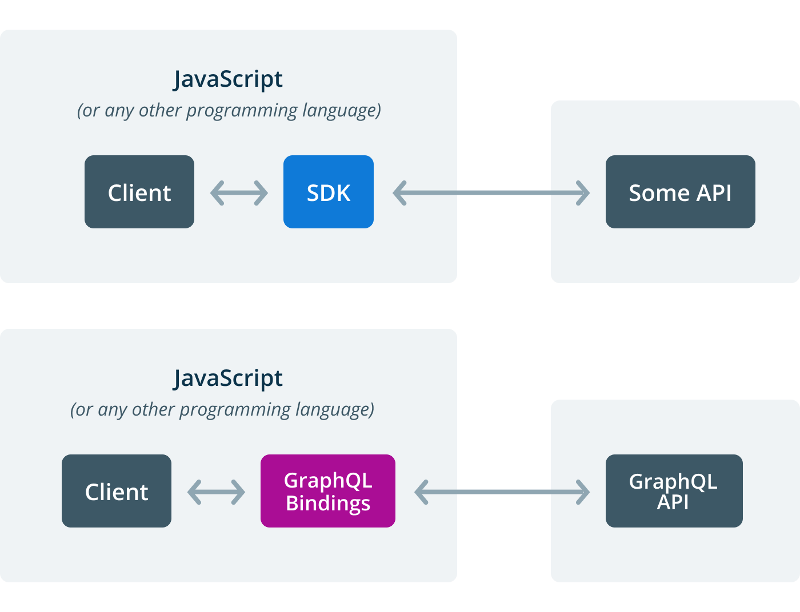

# Overview

<a href="https://github.com/graphql-binding/graphql-binding"></a>

<!-- [](https://github.com/graphql-binding/graphql-binding) -->

## Description

GraphQL bindings provide a convenient way for interacting with a GraphQL API from your programming language: Instead of sending queries as strings via HTTP (e.g. with JavaScript's `fetch`), you invoke a binding function which constructs the query and sends it to the GraphQL server for you.

The GraphQL binding API is extremely flexible, making them a perfect tool for use cases like GraphQL-based service-to-service communication, building GraphQL gateways or accessing GraphQL APIs from simple scripts.

GraphQL bindings are particularly useful in combination with statically typed languages where IDEs and code editors can be configured such that they validate GraphQL requests at compile time and even provide auto-completion for them.

One perspective to think of GraphQL bindings is as auto-generated SDKs for GraphQL APIs:



## Use cases

- GraphQL-based service-to-Service communication
- Building GraphQL gateways
- Composing GraphQL APIs as modular building blocks
- Implementing a custom GraphQL API on top of Prisma
- Sharing runnable instances of GraphQL APIs
- Accessing GraphQL APIs from a script
- Implementing custom operations for an existing GraphQL API

## Simple example

Assume the following GraphQL schema is deployed to a GraphQL server on the web:

```graphql
type User {
  id: ID!
  name: String
}

type Query {
  users: [User!]!
}

type Mutation {
  createUser(name: String!): User!
}
```

The server's API accepts exactly two operations:

- A query to retrieve all `User`s
- A mutation to create a new `User`

Now, assume this GraphQL API would be available as a GraphQL binding (learn how to create your own binding [here](./04-Creating-your-own-Binding.md)) through an NPM package called `graphql-binding-users`.

Here is two scenarios how this binding could be used:

### 1. Usage in a simple Node script

Inside a Node script, you could install the `graphql-binding-users` via `npm` or `yarn` and then use it inside the script:

```js
const userBinding = require('graphql-binding-users')

// Create a new `User`
userBinding.mutation
  .createUser(
    {
      name: 'Alice',
    },
    `{ id }`,
  )
  .then(({ id }) => console.log(`The ID of the created user is: ${id}`))
```

In this example, `createUser` takes two arguments:

1. The **arguments** for the mutation
2. The **selection set** of the mutation

The invocation of the `createUser` binding function therefore constructs and sends the following mutation to the GraphQL server:

```graphql
mutation {
  createUser(name: "Alice") {
    id
  }
}
```

Similarly, you could write script that sends the `users` query via the invocation of a binding function:

```js
const userBinding = require('graphql-binding-users')

// Retrieve all `User`s
userBinding.users({}, `{ id name }`)
  .then(users => console.log(`Retrieved all users: ${users}`))
```

This time, no arguments are being passed and the selection set asks for the `id` and the `name` of the `User`s being returned.

The binding function therefore constructs and sends the following query to the GraphQL server:

```graphql
query {
  users {
    id
    name
  }
}
```

### 2. Usage in a GraphQL gateway

When building gateways for GraphQL-based microservices, bindings are especially helpful. In the previous example, we have demonstrated the API where the _selection set_ for the constructed query is passed as a string. For this use case, the binding API allows to pass on the `info` argument of the GraphQL resolvers.

For this example, consider the above API as a GraphQL microservice and assume you're now building a GraphQL gateway layer on top of it to adjust the functionality. Say you want to add a search feature to the `users` query and also generate random names for the `User`s instead of letting them choose their own names.

This means the gateway layer will have the following schema:

```graphql
type User {
  id: ID!
  name: String
}

type Query {
  user(id: ID!): User
}

type Mutation {
  createUserWithRandomName: User!
}
```

Now, when implementing the resolvers for this schema, you're going to delegate the queries to the underlying GraphQL microservice - by using the binding instance from the `'graphql-binding-users'` package.

```js
const userBinding = require('graphql-binding-users')
const generateName = require('sillyname')

const resolvers = {
  Query: {
    user: async (parent, args, context, info) => {
      const users = await userBinding.query.users({}, info)
      return users.find(user => user.id === args.id)
    },
  },
  Mutation: {
    createUserWithRandomName: (parent, args, context, info) => {
      const sillyName = generateName()
      return userBinding.mutation.createUser(
        {
          name: sillyname,
        },
        info,
      )
  }
}
```

For the `users` and `createUserWithRandomName` resolvers, the binding will behave exactly like in the previous example and construct a GraphQL query/mutation to send to the API.

The big difference to the previous example with the simple Node script is that now the selection set is not _hardcoded_ any more. Instead, it is provided through the [`info`](https://blog.graph.cool/graphql-server-basics-demystifying-the-info-argument-in-graphql-resolvers-6f26249f613a) object of the incoming query/mutation. The `info` object carries the [abstract syntax tree](https://medium.com/@cjoudrey/life-of-a-graphql-query-lexing-parsing-ca7c5045fad8) (AST) of the incoming GraphQL query, meaning it knows the requested fields as well as any arguments and can simply pass them along to the underlying GraphQL API - this is called query [delegation](https://blog.graph.cool/graphql-schema-stitching-explained-schema-delegation-4c6caf468405).

> **Note**: To learn more about the `info`object, check out this deep-dive [article](https://blog.graph.cool/graphql-server-basics-demystifying-the-info-argument-in-graphql-resolvers-6f26249f613a) into its structure as well as its role during the query resolution process.